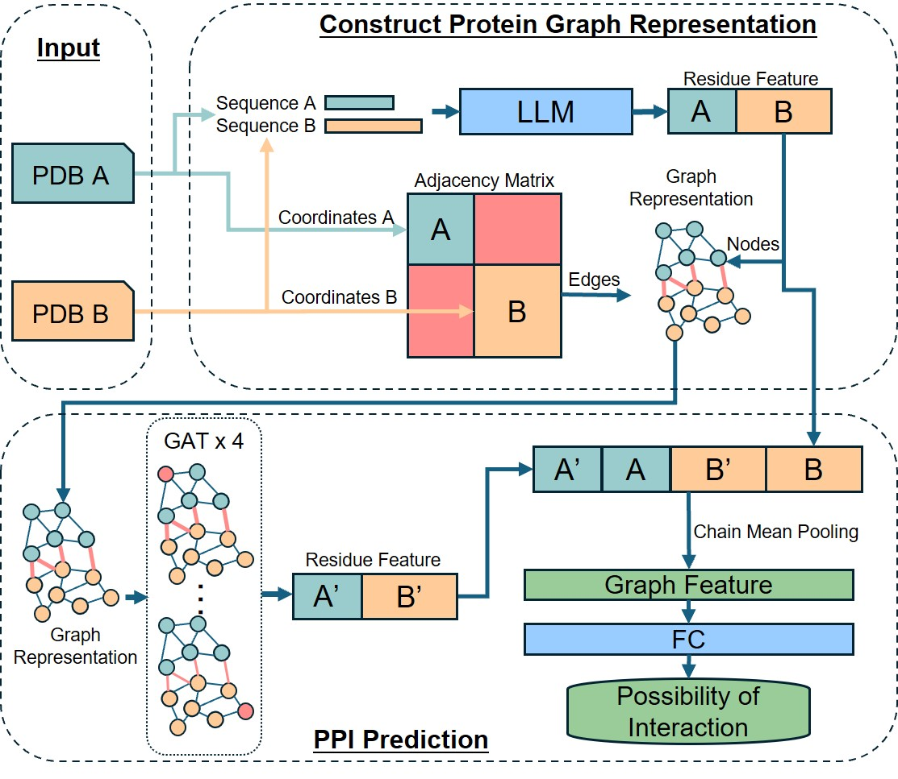

# SpatialPPIv2

SpatialPPIv2 is an advanced graph-neural-network-based model that predicts PPIs by using large language models to embed sequence features and Graph Attention Networks to capture structural information.



Input protein structures (PDB files) were used to extract structural and sequence features. The distance matrix within proteins was used to construct the edges in the protein graph representation. The protein sequence information encoded by language models was used as the features of nodes in the graph representation. The distance matrix within proteins was used to construct the edges in the protein graph representation. The protein sequence information encoded by language models was used as the node features in the graph representation. The residues between two proteins are fully connected to increase the message passing between proteins. The overall graph features of protein pairs were obtained by chain mean pooling the protein features directly obtained from language models and the relationship features output by GAT and used to calculate the possibility of interaction between proteins.

## Prepare Environment

SpatialPPIv2 support multiple environment configuration methods, including docker, apptainer and conda. 

You can find the environment file under `env` folder.

### Run in Colab

<a target="_blank" href="https://colab.research.google.com/github/ohuelab/SpatialPPIv2/blob/main/demo/SpatialPPIv2_Colab_Example.ipynb">
  
</a>

### Apptainer

```
apptainer build -s --nv ${CONTAINER_PATH} ./env/Apptainer
```

### Docker

```
docker build -t ${IMAGE_NAME} ./env
```

### Conda

```
conda create -n pytorch221 python=3.11
conda activate pytorch221
conda install pytorch torchvision torchaudio pytorch-cuda=11.8 -c pytorch -c nvidia
pip install numpy pandas seaborn tensorboard
pip install torch_geometric==2.5.1
pip install pyg_lib torch_scatter torch_sparse torch_cluster torch_spline_conv -f https://data.pyg.org/whl/torch-2.2.0+cu118.html
conda install lightning -c conda-forge
pip install lightning[extra]
pip install matplotlib==3.8.3
pip install biopandas==0.5.1
pip install biopython==1.83
pip install transformers==4.40.2
pip install sentencepiece==0.2.0
pip install torchsummary==1.5.1
pip install scipy==1.12.0
pip install torch_cluster -f https://data.pyg.org/whl/torch-2.2.0+cu118.html
pip install git+https://github.com/yusuf1759/prodigy-cryst.git
pip install pinder[all]
pip install fair-esm
```

## Inference protein interactions

### Inference protein interactions with `pdb`/`cif` files

```
python inference.py --A demo/P33895.pdb --B demo/P40460.pdb
```

Options:

- `--A`: Path to the `pdb`/`cif` file
- `--chain_A`: The chain ID of the first protein. By default, the first chain in the file is used.
- `--B`: Path to the `pdb`/`cif` file
- `--chain_B`: The chain ID of the first protein. By default, the first chain in the file is used.
- `--model`: The model to use. For `pdb`/`cif` file, this will be `ProtT5` and `Rostlab/prot_t5_xl_uniref50` embedding will be used.
- `--device`: Either `cuda` or `cpu`. The device to use.

### Inference protein interactions with `fasta` files

When there is no suitable protein structure file, `fasta` files can be used to make inferences based on protein sequences. This model is based on the attention contact of ESM-2. If the input file is in `fasta` format, the `esm2_t33_650M_UR50D` model will be forced to be used. Example:

```
python inference.py --A demo/D3INY1.fasta --B demo/P62593.fasta
```

### Visualization of inference process

Please check the [notebook](https://github.com/ohuelab/SpatialPPIv2/blob/main/demo/example_visualize.ipynb).

## Train Model

To replicate our research, please follow these steps:

### Get dataset

### 1. Download PINDER dataset. 

You can refer to [here](https://github.com/pinder-org/pinder?tab=readme-ov-file#%EF%B8%8F-getting-the-dataset)

```
export PINDER_RELEASE=2024-02
export PINDER_BASE_DIR=~/my-custom-location-for-pinder/pinder
pinder_download
```

#### Set the path in `config/default.yaml`

Change `data_root` to `~/my-custom-location-for-pinder/pinder/2024-02/pdbs`

### 2. Download BioGRID

```
wget -O datasets/BIOGRID-ALL-4.4.238.tab3.zip https://downloads.thebiogrid.org/Download/BioGRID/Release-Archive/BIOGRID-4.4.238/BIOGRID-ALL-4.4.238.tab3.zip
unzip -d datasets/ datasets/BIOGRID-ALL-4.4.238.tab3.zip
```

### 3. Generate dataset

Notice: Do not use exclude for test set.

```
python scripts/dataset_generator.py --exclude scripts/exclude.txt --split train --biogrid datasets/BIOGRID-ALL-4.4.238.tab3.txt
```

### [Optional] Calculate embedding to disk

This will speed up training process

```
python scripts/calculate_embedding.py --split train --workers 8 --saveroot datasets/train
```

After the calculation, edit the `config/default.yaml` config file accordingly.

- Change the `path` to the used above
- Change the `type` to `ondisk`

### Train model

The training log and model weights will be saved in `lightning_logs`

```
python main.py --task train
```

### Evaluate model

```
python main.py --task eval --checkpoint <path to ckpt checkpoint> --output pred.npy
```


## License

[](https://opensource.org/licenses/Apache-2.0)


## Reference
- Hu W, Ohue M. [SpatialPPIv2: Enhancing protein–protein interaction prediction through graph neural networks with protein language models](https://doi.org/10.1016/j.csbj.2025.01.022). _Computational and Structural Biotechnology Journal_, 27: 508-518, 2025. doi: 10.1016/j.csbj.2025.01.022
